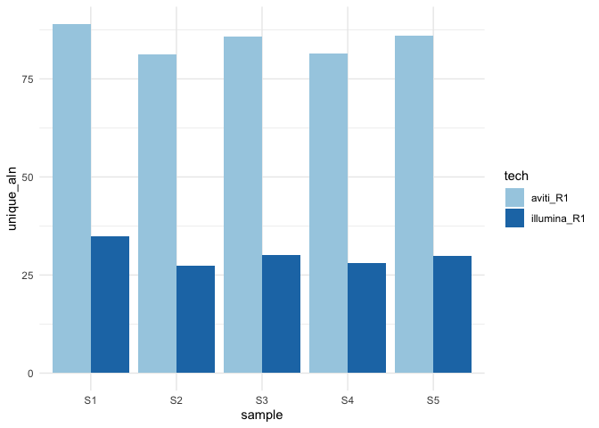
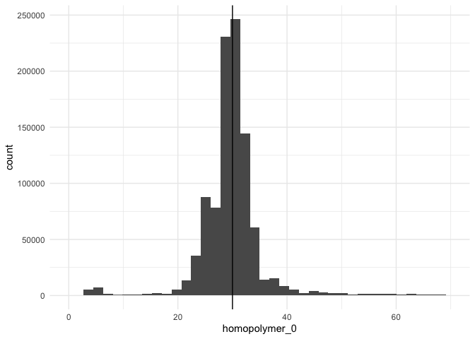
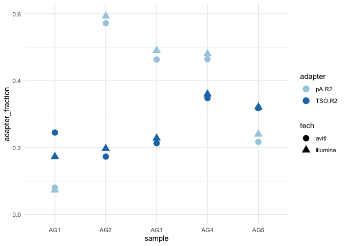
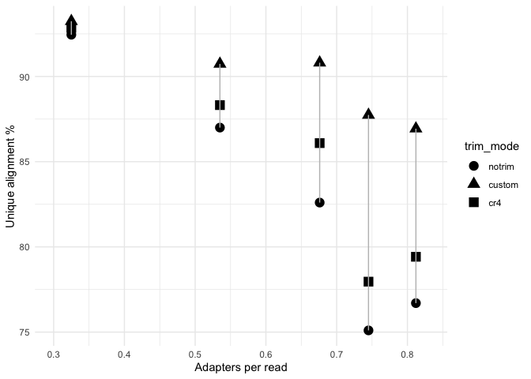
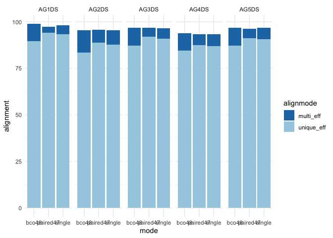
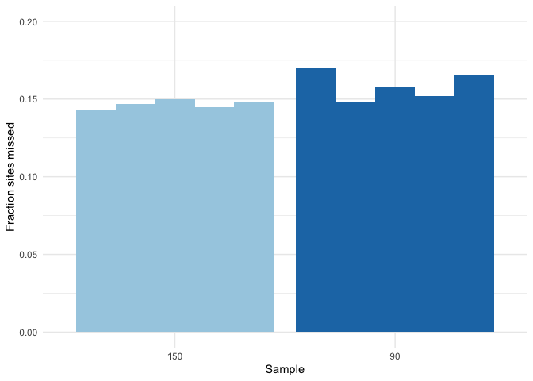
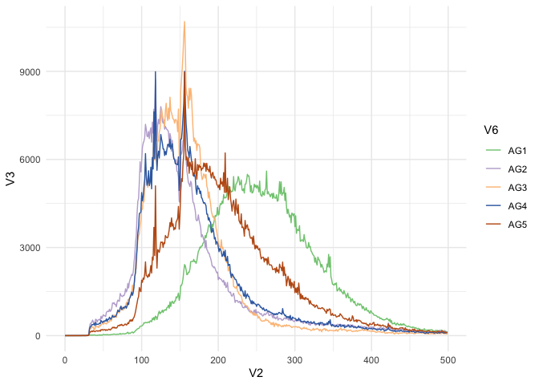
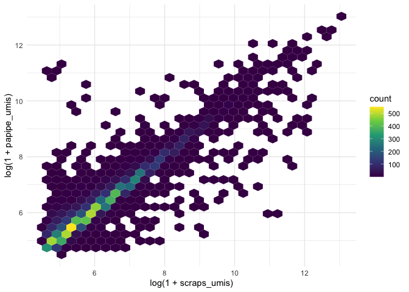
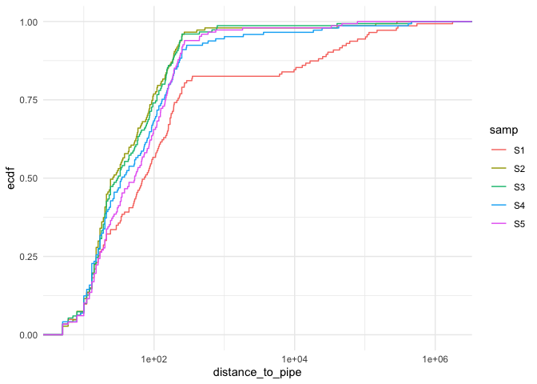

Instrument and sequencing configuration for alignment and PAS analysis
================

Benchmarking illumina and element sequencing for single-cell RNA-seq
with paired-end 150bp x 150bp configuration

``` r
# download gene annotation from ensembl to calculate last exon length
if(!file.exists("data/hg_ensembl.csv")){
  library(biomaRt)
  hgEns = biomaRt::getBM(attributes = c("ensembl_gene_id","ensembl_transcript_id","ensembl_exon_id",
                                      "rank","exon_chrom_start","exon_chrom_end","strand",
                                      "transcript_biotype"),
                       mart = biomaRt::useMart("ensembl",dataset = "hsapiens_gene_ensembl"),
                       filters = "biotype",values = "protein_coding")
  data.table::fwrite(hgEns,file="data/hg_ensembl.csv",col.names = T,sep=",")
}
hgEns = data.table::fread("data/hg_ensembl.csv")

lex_len = hgEns %>% group_by(ensembl_transcript_id) %>% 
  filter(rank == max(rank) & rank > 1, transcript_biotype == "protein_coding") %>% 
  mutate(last_exon_length = exon_chrom_end - exon_chrom_start)

quantile(lex_len$last_exon_length,probs = c(0:10)/10)
```

    ##    0%   10%   20%   30%   40%   50%   60%   70%   80%   90%  100% 
    ##     0    79   148   239   352   498   733  1117  1736  2852 33289

``` r
# load polyadenylation site database (originally from 3'READS assay)
pas_db = data.table::fread("data/apa/polyadb32.hg38.saf.gz")
pas_db = pas_db %>% mutate(Start = ifelse(Strand == "+", Start+10, End-10)) %>%
  dplyr::select(-End,-GeneID) %>% dplyr::rename(start = Start, chr = Chr, strand = Strand) %>%
  distinct() %>% mutate(end = start)
pas_db = makeGRangesFromDataFrame(pas_db)

quantile(data.frame(distanceToNearest(pas_db))$distance,probs = c(0:10)/10)
```

    ##        0%       10%       20%       30%       40%       50%       60%       70% 
    ##      24.0      39.0      62.0     104.0     201.0     446.0    1008.0    2279.0 
    ##       80%       90%      100% 
    ##    5600.0   17263.4 2216854.0

``` r
# insert size dist. 

cmd=paste0('zgrep ^IS ', "data/qc/AG1.qc.tsv.gz", ' | cut -f 2-')

ilen = NA
for(i in c("AG1","AG2","AG3","AG4","AG5")){
  newcmd = gsub("AG1",i,cmd)
  assign(paste0(i,"_inserts"),read.table(pipe(newcmd), comment.char="$",header=F) %>% filter(V4 == "R+") %>% mutate(V2 = as.numeric(V2), V3=as.numeric(V3), V5=as.numeric(V5)) %>%
           mutate(V6 = i))
}

# load insert size data from aviti data
isize = data.frame("samp"=c("S1","S2","S3","S4","S5"),
                  "median" = unlist(lapply(list(AG1_inserts,AG2_inserts,AG3_inserts,AG4_inserts,AG5_inserts),
       FUN = function(x){(x %>% filter(V5 < .5) %>% tail(1))$V2})))

# load adapter content statistics
adapter_stat = data.table::fread("data/adapter_counts_per1M.tsv")
adapter_stat$samp = gsub("AG","S",adapter_stat$sample)

mapstat_ori = data.table::fread("data/qc/ds_trimintv2_mapping.txt",sep="\t",h=F)

mapstat = mapstat_ori %>% mutate(V3 = unlist(lapply(strsplit(V1,":"),`[`,2)),
                             V1 = unlist(lapply(strsplit(V1,":"),`[`,1))) %>%
  mutate(V3 = plyr::mapvalues(V3, from=unique(V3),to=c("reads","unique","multi")),
         V1 = gsub("/.*","",V1),
         V2 = as.numeric(gsub("%","",V2)))

mapstat = mapstat %>% pivot_wider(names_from = 'V3', values_from = 'V2')
mapstat = mapstat %>% mutate(unique_eff = unique*reads/1e6, multi_eff = multi*reads/1e6,
                             mode = unlist(lapply(strsplit(V1,"_"),`[`,2)),
                             sample = gsub("trim.*","",V1))

mapstat$samp = gsub("AG","S",mapstat$sample)
mapstat$samp = gsub("DS","",mapstat$samp)

### mapstat cr4
mapstatCr4_ori = data.table::fread("data/qc/ds_cr4_mapping.txt",sep="\t",h=F)

mapstatCr4 = mapstatCr4_ori %>% mutate(V3 = unlist(lapply(strsplit(V1,":"),`[`,2)),
                             V1 = unlist(lapply(strsplit(V1,":"),`[`,1))) %>%
  mutate(V3 = plyr::mapvalues(V3, from=unique(V3),to=c("reads","unique","multi")),
         V1 = gsub("/.*","",V1),
         V2 = as.numeric(gsub("%","",V2)))

mapstatCr4 = mapstatCr4 %>% pivot_wider(names_from = 'V3', values_from = 'V2')
mapstatCr4 = mapstatCr4 %>% mutate(unique_eff = unique*reads/1e6, multi_eff = multi*reads/1e6,
                             mode = unlist(lapply(strsplit(V1,"_"),`[`,2)),
                             sample = gsub("trim.*","",V1))
mapstatCr4$samp = gsub("AG","S",mapstatCr4$sample)
mapstatCr4$samp = gsub("DS_single_null","",mapstatCr4$samp)


##
#mapstat %>% left_join(isize) %>% left_join(adapter_stat %>% filter(tech == "aviti"),by="samp") %>% ggplot(aes(x = (pA.R2), y = median, color = mode)) + geom_point()

set1 <- RColorBrewer::brewer.pal(n = 4, name = "Set1")  # Use a palette with 9 colors
subset_colors <- set1[c(2,1,4)] # Select specific colors (1st, 3rd, 5th)
```

Part 1: Alignment performance

``` r
# import alignment stats
# R1 only alignment perfroamnce:

aln_r1 = data.table::fread("data/qc/R1_alignment.tsv") %>%
    pivot_longer(cols = c(aviti_R1, illumina_R1),values_to = "unique_aln", names_to="tech")
ggplot(aln_r1, aes(x = sample, y = unique_aln, fill=tech)) + geom_col(position="dodge") +
  scale_fill_brewer(palette = "Paired") +
  theme_minimal()
```

<!-- -->

``` r
#ggsave("")


# polyT lenth:
# longest homopolymer with no interruptions:
hp_lengths = data.table::fread("data/hp_lengths_AG1.tsv.gz")
ggplot(hp_lengths, aes(x = homopolymer_0)) + geom_histogram(bins = 40) + theme_minimal() +
  geom_vline(xintercept = 30) + scale_x_continuous(breaks = seq(0, 70, by = 10)) + xlim(0,70)
```

    ## Scale for x is already present.
    ## Adding another scale for x, which will replace the existing scale.

    ## Warning: Removed 6840 rows containing non-finite values (`stat_bin()`).

    ## Warning: Removed 2 rows containing missing values (`geom_bar()`).

<!-- -->

``` r
#ggsave()
```

Part 2: Alignment and adapter trimming factors

``` r
# panel A: adapter content in illumina and aviti
adapter_stat %>% pivot_longer(cols = c(TSO.R1,TSO.R2,pA.R2,Truseq.R1),values_to = "adapter_count",
                          names_to = "adapter") %>% 
  filter(adapter %in% c("TSO.R2","pA.R2")) %>%
  mutate(adapter_fraction = adapter_count/1e3) %>%
  ggplot(aes(x = sample, y = adapter_fraction, shape = tech, color=adapter)) + geom_point(size=4) + theme_minimal() + scale_color_brewer(palette = "Paired") + ylim(0,0.6)
```

<!-- -->

``` r
ggsave("figures/poster_adapter_content.pdf", height=3,width=5)

# panel B: alignment vs trimming, R2 approach
notrim = data.frame("samp"=c("S1",'S2','S3','S4','S5'),
                    'unique_effnotrim'=c(92.45,75.1,82.6,76.7,87))
mapstat %>% filter(mode == "single") %>% dplyr::select(samp,unique_eff) %>%
            left_join(mapstatCr4 %>% dplyr::select(samp, unique_eff),by="samp",suffix = c("custom","cr4")) %>% left_join(notrim,by="samp") %>% pivot_longer(cols = c(unique_effcustom, unique_effcr4, unique_effnotrim), names_to = "trim_mode",values_to = "unique") %>% mutate(trim_mode = gsub("unique_eff","",trim_mode)) %>% left_join(adapter_stat %>% filter(tech == "aviti")) %>% left_join(isize) %>%
  mutate(trim_mode = fct_relevel(trim_mode,"notrim","custom","cr4")) %>%
  ggplot(aes(x = (pA.R2+TSO.R2)/1000, y = unique, shape = trim_mode)) + geom_point(size=4) +
  scale_color_manual(values = subset_colors) +
  geom_line(aes(group=samp),color="gray") + theme_minimal() +
  xlim(c(0.3, 0.83)) +
  labs(x = "Adapters per read",y="Unique alignment %")
```

    ## Joining with `by = join_by(samp)`
    ## Joining with `by = join_by(samp)`

<!-- -->

``` r
ggsave("figures/align_trim.pdf",width=4.5,height=3)

# panel C: final alignment rates with optimized workflow
mapstat %>% pivot_longer(cols = c(multi_eff, unique_eff), values_to = "alignment", names_to="alignmode") %>%
  ggplot(aes(x = mode, y = alignment, fill = alignmode)) + geom_col() +  facet_wrap(~sample,nrow=1) +
  scale_fill_brewer(palette="Paired",direction=-1) + theme_minimal()
```

<!-- -->

``` r
ggsave("final_alignment.pdf")
```

    ## Saving 7 x 5 in image

Part 3: PAS comparison

``` r
# what is the count of PAS from the different methods?
# how many reads and how many sites?
# are the counts similar?

  
# from https://github.com/rnabioco/scraps/blob/master/ref/polyadb32.hg38.saf.gz
refSites = data.table::fread("data/apa/polyadb32.hg38.saf.gz") %>% dplyr::select(-GeneID) %>% distinct()
refSites = makeGRangesFromDataFrame(refSites)

# function to load the counts and match them to annotated PAS db used by scraps
load_papipe = function(counts_path, peak_path, ref_sites){
  # import the counts, which has a gene named like 'chr_start_strand'
  # import the sites gff, which also has the coordinates and misprime info
  sites = polyApiper::read_polyA_peak_file_gtf(peak_path)
  sites = sites %>% dplyr::rename(papipe_peak = peak)
  #counts = data.table::fread(counts_path) %>% dplyr::rename(papipe_peak = gene) %>%
  #  group_by(papipe_peak) %>% summarise(papipe_umis = sum(count))
  counts = data.table::fread(counts_path)
  sites = sites %>% mutate(start = ifelse(strand == "+",end,start),
                           end = ifelse(strand == "-",start, end))
  sites = makeGRangesFromDataFrame(sites)
  # this gives the overlapping intervals but throws away the metadata for no reason
  overlaps = findOverlapPairs(sites, ref_sites)
  # recreate the papipe peak name
  overlapsDf = data.frame(overlaps) %>% mutate(first.strandletter = plyr::mapvalues(first.strand, 
                                                                                    c("+","-"),
                                                                                    c("f","r")))
  
  overlapsDf = overlapsDf %>% mutate(papipe_peak = paste0(first.seqnames, "_",
                                                          first.start, "_",first.strandletter))
  
  # the reference site had a buffer added -10 +5 bp, adjust for this to get the original annotated pas coordinate
  overlapsDf = overlapsDf %>% mutate(ref_pas = ifelse(second.strand == "+",
                              paste0(second.seqnames,"_",second.end-5,"_",first.strandletter),
                              paste0(second.seqnames,"_",second.start+5,"_",first.strandletter)))
  counts_ann = counts %>% right_join(overlapsDf %>% dplyr::select(papipe_peak, ref_pas))
  return(counts_ann)
}

# load in the scraps paired count data
for(i in c("AG1","AG2","AG3","AG4","AG5")){
  dat = data.table::fread(sprintf("data/scraps/%s_gene_counts.tsv",i))
  assign(paste0("scraps_",i), dat %>% separate_wider_delim(gene, delim=";", 
                                                         names=c("gene_name",NA,NA,"chr","coordinate","strand"),
                                                         too_many="drop") %>%
           mutate(ref_pas = paste0(chr,"_",coordinate,"_",ifelse(strand=="+","f","r"))) %>%
           rename(scraps_umis = total_umis))
           #group_by(ref_pas) %>% summarise(gene_name, scraps_umis = sum(count)) %>% distinct())
}

# load in the polya_pipe data (mp prefix indicating misprime peaks are included)
for(i in c("AG1","AG2","AG3","AG4","AG5")){
  assign(paste0('mppapipe_', i),load_papipe(sprintf("data/apa/polyapipe/%s_150_gene_counts.tsv",i),
                                          sprintf("data/apa/polyapipe/%s_cr4_polyA_peaks.gff",i),
                                          refSites))
  assign(paste0('mppapipe90_', i),load_papipe(sprintf("data/apa/polyapipe/%s_90_gene_counts.tsv",i),
                                          sprintf("data/apa/polyapipe/%s_cr490_polyA_peaks.gff",i),
                                          refSites))
}
```

    ## 

    ## Warning in .Seqinfo.mergexy(x, y): Each of the 2 combined objects has sequence levels not in the other:
    ##   - in 'x': chrM, GL000008.2, GL000194.1, GL000195.1, GL000208.1, GL000218.1, GL000219.1, GL000220.1, GL000221.1, KI270438.1, KI270706.1, KI270711.1, KI270713.1, KI270719.1, KI270727.1, KI270728.1, KI270733.1, KI270734.1, KI270742.1, KI270744.1, KI270745.1, KI270749.1
    ##   - in 'y': chr1_KI270706v1_random, chr4_GL000008v2_random, chr7_KI270803v1_alt, chr8_KI270821v1_alt, chr14_GL000009v2_random, chr22_KI270879v1_alt, chrUn_KI270742v1
    ##   Make sure to always combine/compare objects based on the same reference
    ##   genome (use suppressWarnings() to suppress this warning).

    ## Joining with `by = join_by(papipe_peak)`

    ## Warning in .Seqinfo.mergexy(x, y): Each of the 2 combined objects has sequence levels not in the other:
    ##   - in 'x': chrM, GL000194.1, GL000205.2, GL000219.1, KI270713.1, KI270718.1, KI270722.1, KI270727.1, KI270733.1, KI270734.1, KI270744.1
    ##   - in 'y': chr1_KI270706v1_random, chr4_GL000008v2_random, chr7_KI270803v1_alt, chr8_KI270821v1_alt, chr14_GL000009v2_random, chr22_KI270879v1_alt, chrUn_KI270742v1
    ##   Make sure to always combine/compare objects based on the same reference
    ##   genome (use suppressWarnings() to suppress this warning).

    ## Joining with `by = join_by(papipe_peak)`

    ## Warning in .Seqinfo.mergexy(x, y): Each of the 2 combined objects has sequence levels not in the other:
    ##   - in 'x': chrM, GL000194.1, GL000195.1, GL000205.2, GL000208.1, GL000216.2, GL000218.1, GL000219.1, GL000220.1, GL000221.1, GL000224.1, KI270330.1, KI270438.1, KI270442.1, KI270706.1, KI270711.1, KI270713.1, KI270718.1, KI270720.1, KI270721.1, KI270722.1, KI270726.1, KI270727.1, KI270729.1, KI270733.1, KI270734.1, KI270735.1, KI270742.1, KI270743.1, KI270744.1, KI270745.1, KI270748.1, KI270749.1, KI270751.1
    ##   - in 'y': chr1_KI270706v1_random, chr4_GL000008v2_random, chr7_KI270803v1_alt, chr8_KI270821v1_alt, chr14_GL000009v2_random, chr22_KI270879v1_alt, chrUn_KI270742v1
    ##   Make sure to always combine/compare objects based on the same reference
    ##   genome (use suppressWarnings() to suppress this warning).

    ## Joining with `by = join_by(papipe_peak)`

    ## Warning in .Seqinfo.mergexy(x, y): Each of the 2 combined objects has sequence levels not in the other:
    ##   - in 'x': chrM, GL000009.2, GL000194.1, GL000195.1, GL000205.2, GL000216.2, GL000218.1, GL000219.1, GL000221.1, GL000224.1, KI270438.1, KI270442.1, KI270706.1, KI270711.1, KI270712.1, KI270713.1, KI270718.1, KI270719.1, KI270721.1, KI270725.1, KI270727.1, KI270728.1, KI270729.1, KI270733.1, KI270734.1, KI270744.1, KI270745.1
    ##   - in 'y': chr1_KI270706v1_random, chr4_GL000008v2_random, chr7_KI270803v1_alt, chr8_KI270821v1_alt, chr14_GL000009v2_random, chr22_KI270879v1_alt, chrUn_KI270742v1
    ##   Make sure to always combine/compare objects based on the same reference
    ##   genome (use suppressWarnings() to suppress this warning).

    ## Joining with `by = join_by(papipe_peak)`

    ## Warning in .Seqinfo.mergexy(x, y): Each of the 2 combined objects has sequence levels not in the other:
    ##   - in 'x': chrM, GL000008.2, GL000194.1, GL000195.1, GL000205.2, GL000208.1, GL000216.2, GL000218.1, GL000219.1, GL000220.1, GL000221.1, GL000224.1, KI270438.1, KI270442.1, KI270467.1, KI270706.1, KI270707.1, KI270711.1, KI270712.1, KI270713.1, KI270718.1, KI270720.1, KI270727.1, KI270728.1, KI270733.1, KI270734.1, KI270742.1, KI270743.1, KI270744.1, KI270745.1, KI270749.1
    ##   - in 'y': chr1_KI270706v1_random, chr4_GL000008v2_random, chr7_KI270803v1_alt, chr8_KI270821v1_alt, chr14_GL000009v2_random, chr22_KI270879v1_alt, chrUn_KI270742v1
    ##   Make sure to always combine/compare objects based on the same reference
    ##   genome (use suppressWarnings() to suppress this warning).

    ## Joining with `by = join_by(papipe_peak)`

    ## Warning in .Seqinfo.mergexy(x, y): Each of the 2 combined objects has sequence levels not in the other:
    ##   - in 'x': chrM, GL000008.2, GL000195.1, GL000205.2, GL000219.1, KI270438.1, KI270442.1, KI270706.1, KI270711.1, KI270713.1, KI270719.1, KI270722.1, KI270728.1, KI270733.1, KI270734.1, KI270736.1, KI270745.1
    ##   - in 'y': chr1_KI270706v1_random, chr4_GL000008v2_random, chr7_KI270803v1_alt, chr8_KI270821v1_alt, chr14_GL000009v2_random, chr22_KI270879v1_alt, chrUn_KI270742v1
    ##   Make sure to always combine/compare objects based on the same reference
    ##   genome (use suppressWarnings() to suppress this warning).

    ## Joining with `by = join_by(papipe_peak)`

    ## Warning in .Seqinfo.mergexy(x, y): Each of the 2 combined objects has sequence levels not in the other:
    ##   - in 'x': chrM, GL000008.2, GL000009.2, GL000194.1, GL000195.1, GL000205.2, GL000208.1, GL000214.1, GL000218.1, GL000219.1, GL000220.1, GL000221.1, KI270303.1, KI270304.1, KI270315.1, KI270330.1, KI270435.1, KI270442.1, KI270706.1, KI270707.1, KI270711.1, KI270712.1, KI270713.1, KI270714.1, KI270717.1, KI270718.1, KI270719.1, KI270721.1, KI270722.1, KI270727.1, KI270728.1, KI270729.1, KI270733.1, KI270734.1, KI270742.1, KI270744.1, KI270749.1, KI270751.1, KI270753.1
    ##   - in 'y': chr1_KI270706v1_random, chr4_GL000008v2_random, chr7_KI270803v1_alt, chr8_KI270821v1_alt, chr14_GL000009v2_random, chr22_KI270879v1_alt, chrUn_KI270742v1
    ##   Make sure to always combine/compare objects based on the same reference
    ##   genome (use suppressWarnings() to suppress this warning).

    ## Joining with `by = join_by(papipe_peak)`

    ## Warning in .Seqinfo.mergexy(x, y): Each of the 2 combined objects has sequence levels not in the other:
    ##   - in 'x': chrM, GL000009.2, GL000194.1, GL000195.1, GL000205.2, GL000216.2, GL000218.1, GL000219.1, GL000220.1, GL000221.1, KI270330.1, KI270438.1, KI270442.1, KI270706.1, KI270711.1, KI270712.1, KI270713.1, KI270718.1, KI270719.1, KI270720.1, KI270728.1, KI270733.1, KI270734.1, KI270742.1, KI270744.1, KI270746.1
    ##   - in 'y': chr1_KI270706v1_random, chr4_GL000008v2_random, chr7_KI270803v1_alt, chr8_KI270821v1_alt, chr14_GL000009v2_random, chr22_KI270879v1_alt, chrUn_KI270742v1
    ##   Make sure to always combine/compare objects based on the same reference
    ##   genome (use suppressWarnings() to suppress this warning).

    ## Joining with `by = join_by(papipe_peak)`

    ## Warning in .Seqinfo.mergexy(x, y): Each of the 2 combined objects has sequence levels not in the other:
    ##   - in 'x': chrM, GL000008.2, GL000009.2, GL000194.1, GL000195.1, GL000205.2, GL000208.1, GL000218.1, GL000219.1, GL000220.1, GL000221.1, GL000224.1, KI270330.1, KI270442.1, KI270706.1, KI270710.1, KI270711.1, KI270713.1, KI270717.1, KI270718.1, KI270719.1, KI270721.1, KI270725.1, KI270726.1, KI270727.1, KI270728.1, KI270731.1, KI270733.1, KI270734.1, KI270742.1, KI270743.1, KI270744.1, KI270745.1, KI270746.1, KI270749.1, KI270751.1
    ##   - in 'y': chr1_KI270706v1_random, chr4_GL000008v2_random, chr7_KI270803v1_alt, chr8_KI270821v1_alt, chr14_GL000009v2_random, chr22_KI270879v1_alt, chrUn_KI270742v1
    ##   Make sure to always combine/compare objects based on the same reference
    ##   genome (use suppressWarnings() to suppress this warning).

    ## Joining with `by = join_by(papipe_peak)`

    ## Warning in .Seqinfo.mergexy(x, y): Each of the 2 combined objects has sequence levels not in the other:
    ##   - in 'x': chrM, GL000009.2, GL000194.1, GL000195.1, GL000205.2, GL000216.2, GL000218.1, GL000219.1, GL000221.1, GL000225.1, KI270435.1, KI270442.1, KI270707.1, KI270711.1, KI270713.1, KI270718.1, KI270719.1, KI270720.1, KI270721.1, KI270726.1, KI270727.1, KI270728.1, KI270729.1, KI270731.1, KI270733.1, KI270734.1, KI270742.1, KI270743.1, KI270744.1, KI270750.1
    ##   - in 'y': chr1_KI270706v1_random, chr4_GL000008v2_random, chr7_KI270803v1_alt, chr8_KI270821v1_alt, chr14_GL000009v2_random, chr22_KI270879v1_alt, chrUn_KI270742v1
    ##   Make sure to always combine/compare objects based on the same reference
    ##   genome (use suppressWarnings() to suppress this warning).

    ## Joining with `by = join_by(papipe_peak)`

``` r
mppas_count_dfnew = data.frame("counts" = c(unlist(lapply(list(mppapipe_AG1,mppapipe_AG2,mppapipe_AG3,mppapipe_AG4,mppapipe_AG5),FUN=function(x){sum(x[,2],na.rm=T)})),
unlist(lapply(list(mppapipe90_AG1,mppapipe90_AG2,mppapipe90_AG3,mppapipe90_AG4,mppapipe90_AG5),FUN=function(x){sum(x[,2],na.rm=T)})),
unlist(lapply(list(scraps_AG1,scraps_AG2,scraps_AG3,scraps_AG4,scraps_AG5),FUN=function(x){sum(x[,5],na.rm=T)}))),
            "sample" = rep(c("S1","S2","S3","S4","S5"),times=3),
            "mode" = rep(c("pA_pipe","pA_pipe_90","scraps"),each=5),
            "exon_counts" = c(43130405,76941760,71511053,71639359,152833367))

# total counts assigned to annotated polyadenylation sites (allowing -10/+5 buffer)
pas_plot_wmisprime = ggplot(mppas_count_dfnew, aes(x = sample, y = counts/exon_counts, color = mode)) + geom_point() + theme_minimal() +
  geom_line(aes(group = mode)) + scale_color_brewer(palette = "Paired")
ggsave("figures/pas_assign_w_misprime.pdf",plot=pas_plot_wmisprime,
       width = 4, height=3)
```

``` r
# PAS plots

# what fraction of sites are 'missed' by R2?
# 
missed = c(full_join(scraps_AG1, mppapipe_AG1) %>% arrange(desc(scraps_umis)) %>% head(1000) %>%
  ungroup() %>% summarise(sum(is.na(papipe_umis))),
full_join(scraps_AG2, mppapipe_AG2) %>% arrange(desc(scraps_umis)) %>% head(1000) %>%
  ungroup() %>% summarise(sum(is.na(papipe_umis))),
full_join(scraps_AG3, mppapipe_AG3) %>% arrange(desc(scraps_umis)) %>% head(1000) %>%
  ungroup() %>% summarise(sum(is.na(papipe_umis))),
full_join(scraps_AG4, mppapipe_AG4) %>% arrange(desc(scraps_umis)) %>% head(1000) %>%
  ungroup() %>% summarise(sum(is.na(papipe_umis))),
full_join(scraps_AG5, mppapipe_AG5) %>% arrange(desc(scraps_umis)) %>% head(1000) %>%
  ungroup() %>% summarise(sum(is.na(papipe_umis))))
```

    ## Joining with `by = join_by(ref_pas)`
    ## Joining with `by = join_by(ref_pas)`
    ## Joining with `by = join_by(ref_pas)`
    ## Joining with `by = join_by(ref_pas)`
    ## Joining with `by = join_by(ref_pas)`

``` r
missed90 = c(full_join(scraps_AG1, mppapipe90_AG1) %>% arrange(desc(scraps_umis)) %>% head(1000) %>%
  ungroup() %>% summarise(sum(is.na(papipe_umis))),
full_join(scraps_AG2, mppapipe90_AG2) %>% arrange(desc(scraps_umis)) %>% head(1000) %>%
  ungroup() %>% summarise(sum(is.na(papipe_umis))),
full_join(scraps_AG3, mppapipe90_AG3) %>% arrange(desc(scraps_umis)) %>% head(1000) %>%
  ungroup() %>% summarise(sum(is.na(papipe_umis))),
full_join(scraps_AG4, mppapipe90_AG4) %>% arrange(desc(scraps_umis)) %>% head(1000) %>%
  ungroup() %>% summarise(sum(is.na(papipe_umis))),
full_join(scraps_AG5, mppapipe90_AG5) %>% arrange(desc(scraps_umis)) %>% head(1000) %>%
  ungroup() %>% summarise(sum(is.na(papipe_umis))))
```

    ## Joining with `by = join_by(ref_pas)`
    ## Joining with `by = join_by(ref_pas)`
    ## Joining with `by = join_by(ref_pas)`
    ## Joining with `by = join_by(ref_pas)`
    ## Joining with `by = join_by(ref_pas)`

``` r
data.frame("mode"=rep(c("90","150"),each=5),
           "samp"=rep(c("S1","S2","S3","S4","S5"),times=2),
           "missingness"=c(as.numeric(missed90),as.numeric(missed))) %>%
  ggplot(aes(x = mode, group=samp, y = missingness/1000, fill=mode)) + geom_col(position="dodge") + theme_minimal() +
  scale_fill_brewer(palette="Paired") + labs(y = "Fraction sites missed", x = "Sample") +
  ylim(c(0,.20)) + theme(legend.position = "none")
```

<!-- -->

``` r
ggsave(filename="figures/missed_pas.pdf",width=2,height=3)
```

``` r
pa_cors = as.numeric(c(full_join(scraps_AG1, mppapipe_AG1) %>% arrange(desc(scraps_umis)) %>% filter(scraps_umis > 100 | papipe_umis > 100) %>% ungroup() %>% summarise(r=cor(log(scraps_umis+1), log(papipe_umis+1),use = "pairwise.complete.obs")),
  full_join(scraps_AG2, mppapipe_AG2) %>% arrange(desc(scraps_umis)) %>% filter(scraps_umis > 100 | papipe_umis > 100) %>% ungroup() %>% summarise(r=cor(log(scraps_umis+1), log(papipe_umis+1),use = "pairwise.complete.obs")),
  full_join(scraps_AG3, mppapipe_AG3) %>% arrange(desc(scraps_umis)) %>% filter(scraps_umis > 100 | papipe_umis > 100) %>% ungroup() %>% summarise(r=cor(log(scraps_umis+1), log(papipe_umis+1),use = "pairwise.complete.obs")),
  full_join(scraps_AG4, mppapipe_AG4) %>% arrange(desc(scraps_umis)) %>% filter(scraps_umis > 100 | papipe_umis > 100) %>% ungroup() %>% summarise(r=cor(log(scraps_umis+1), log(papipe_umis+1),use = "pairwise.complete.obs")),
  full_join(scraps_AG5, mppapipe_AG5) %>% arrange(desc(scraps_umis)) %>% filter(scraps_umis > 100 | papipe_umis > 100) %>% ungroup() %>% summarise(r=cor(log(scraps_umis+1), log(papipe_umis+1),use = "pairwise.complete.obs"))))
```

    ## Joining with `by = join_by(ref_pas)`
    ## Joining with `by = join_by(ref_pas)`
    ## Joining with `by = join_by(ref_pas)`
    ## Joining with `by = join_by(ref_pas)`
    ## Joining with `by = join_by(ref_pas)`

``` r
pa90_cors = as.numeric(c(full_join(scraps_AG1, mppapipe90_AG1) %>% arrange(desc(scraps_umis)) %>% filter(scraps_umis > 100 | papipe_umis > 100) %>% ungroup() %>% summarise(r=cor(log(scraps_umis+1), log(papipe_umis+1),use = "pairwise.complete.obs")),
  full_join(scraps_AG2, mppapipe90_AG2) %>% arrange(desc(scraps_umis)) %>% filter(scraps_umis > 100 | papipe_umis > 100) %>% ungroup() %>% summarise(r=cor(log(scraps_umis+1), log(papipe_umis+1),use = "pairwise.complete.obs")),
  full_join(scraps_AG3, mppapipe90_AG3) %>% arrange(desc(scraps_umis)) %>% filter(scraps_umis > 100 | papipe_umis > 100) %>% ungroup() %>% summarise(r=cor(log(scraps_umis+1), log(papipe_umis+1),use = "pairwise.complete.obs")),
  full_join(scraps_AG4, mppapipe90_AG4) %>% arrange(desc(scraps_umis)) %>% filter(scraps_umis > 100 | papipe_umis > 100) %>% ungroup() %>% summarise(r=cor(log(scraps_umis+1), log(papipe_umis+1),use = "pairwise.complete.obs")),
  full_join(scraps_AG5, mppapipe90_AG5) %>% arrange(desc(scraps_umis)) %>% filter(scraps_umis > 100 | papipe_umis > 100) %>% ungroup() %>% summarise(r=cor(log(scraps_umis+1), log(papipe_umis+1),use = "pairwise.complete.obs"))))
```

    ## Joining with `by = join_by(ref_pas)`
    ## Joining with `by = join_by(ref_pas)`
    ## Joining with `by = join_by(ref_pas)`
    ## Joining with `by = join_by(ref_pas)`
    ## Joining with `by = join_by(ref_pas)`

``` r
# INSERTS DISTRIBUTION FIGURE SAVE

acce <- RColorBrewer::brewer.pal(n = 7, name = "Accent")
 ggplot(do.call(rbind,list(AG1_inserts,AG2_inserts,AG3_inserts,AG4_inserts,AG5_inserts)) %>% filter(V2 < 500), aes(x = V2, y = V3)) + geom_line(aes(color=V6)) + scale_color_manual(values = acce[c(-4,-6)]) +
  theme_minimal()
```

<!-- -->

``` r
 ggsave(filename="figures/insert_lines.pdf",width=4,height=3)
```

``` r
inner_join(scraps_AG1, mppapipe_AG1) %>% 
  filter(scraps_umis > 100 & papipe_umis > 100) %>%
  ggplot(aes(x = log(1+scraps_umis), y = log(1+papipe_umis))) + geom_hex() +
  theme_minimal() + scale_fill_viridis_c()
```

    ## Joining with `by = join_by(ref_pas)`

<!-- -->

``` r
ggsave(filename = "figures/pas_counts_hex.pdf",width = 4,height=3)

inner_join(scraps_AG1, mppapipe_AG1) %>% 
  filter(scraps_umis > 0 & papipe_umis > 0) %>%
  with(data = ., cor(log(scraps_umis), log(papipe_umis)))
```

    ## Joining with `by = join_by(ref_pas)`

    ## [1] 0.9263645

``` r
# for the sites very PaPIPE missed it, how far away is this closest site?

sites_pipe1 = polyApiper::read_polyA_peak_file_gtf("data/apa/polyapipe/AG1_cr4_polyA_peaks.gff")
sites_pipe2 = polyApiper::read_polyA_peak_file_gtf("data/apa/polyapipe/AG2_cr4_polyA_peaks.gff")
sites_pipe3 = polyApiper::read_polyA_peak_file_gtf("data/apa/polyapipe/AG3_cr4_polyA_peaks.gff")
sites_pipe4 = polyApiper::read_polyA_peak_file_gtf("data/apa/polyapipe/AG4_cr4_polyA_peaks.gff")
sites_pipe5 = polyApiper::read_polyA_peak_file_gtf("data/apa/polyapipe/AG5_cr4_polyA_peaks.gff")
#rawcounts_pipe3 = data.table::fread("data/apa/polyapipe/AG3_cr4_counts.tab.gz")


# offtarget_pipe3 = makeGRangesFromDataFrame(sites_pipe3 %>% filter(peak %in% check3)) %>% distanceToNearest(pas_db) %>% data.frame(.)
# 
# quantile(offtarget_pipe3$distance[offtarget_pipe3$distance > 0])
# ggplot(offtarget_pipe3, aes(x = log10(distance))) + geom_histogram()
```

``` r
# of the expressed scraps refsites, how close is the nearest papipe site?

# 1 get the expressed scraps refsites not det by papipe
missed_ref1 = (full_join(scraps_AG1, mppapipe_AG1) %>% arrange(desc(scraps_umis)) %>% head(1000) %>% filter(is.na(papipe_umis)))$ref_pas
```

    ## Joining with `by = join_by(ref_pas)`

``` r
missed_ref2 = (full_join(scraps_AG2, mppapipe_AG2) %>% arrange(desc(scraps_umis)) %>% head(1000) %>% filter(is.na(papipe_umis)))$ref_pas
```

    ## Joining with `by = join_by(ref_pas)`

``` r
missed_ref3 = (full_join(scraps_AG3, mppapipe_AG3) %>% arrange(desc(scraps_umis)) %>% head(1000) %>% filter(is.na(papipe_umis)))$ref_pas
```

    ## Joining with `by = join_by(ref_pas)`

``` r
missed_ref4 = (full_join(scraps_AG4, mppapipe_AG4) %>% arrange(desc(scraps_umis)) %>% head(1000) %>% filter(is.na(papipe_umis)))$ref_pas
```

    ## Joining with `by = join_by(ref_pas)`

``` r
missed_ref5 = (full_join(scraps_AG5, mppapipe_AG5) %>% arrange(desc(scraps_umis)) %>% head(1000) %>% filter(is.na(papipe_umis)))$ref_pas
```

    ## Joining with `by = join_by(ref_pas)`

``` r
# 2 get the distance to the papipe site
pas_db$ref_pas = with(data.frame(pas_db), paste0(seqnames,"_",start,"_",strand))
pas_db$ref_pas = gsub("\\+","f",pas_db$ref_pas)
pas_db$ref_pas = gsub("\\-","r",pas_db$ref_pas)

pas_missed1 = pas_db[pas_db$ref_pas %in% missed_ref1]
pipe_check1 = sites_pipe1 %>%mutate(start = ifelse(strand == "+",end,start),
                           end = ifelse(strand == "-",start, end))
pipe_check1 = makeGRangesFromDataFrame(pipe_check1)
missDistance1 = distanceToNearest(pas_missed1,pipe_check1)
```

    ## Warning in .Seqinfo.mergexy(x, y): Each of the 2 combined objects has sequence levels not in the other:
    ##   - in 'x': chr1_KI270706v1_random, chr4_GL000008v2_random, chr7_KI270803v1_alt, chr8_KI270821v1_alt, chr14_GL000009v2_random, chr22_KI270879v1_alt, chrUn_KI270742v1
    ##   - in 'y': chrM, GL000008.2, GL000194.1, GL000195.1, GL000208.1, GL000218.1, GL000219.1, GL000220.1, GL000221.1, KI270438.1, KI270706.1, KI270711.1, KI270713.1, KI270719.1, KI270727.1, KI270728.1, KI270733.1, KI270734.1, KI270742.1, KI270744.1, KI270745.1, KI270749.1
    ##   Make sure to always combine/compare objects based on the same reference
    ##   genome (use suppressWarnings() to suppress this warning).

``` r
pas_missed2 = pas_db[pas_db$ref_pas %in% missed_ref2]
pipe_check2 = sites_pipe2 %>%mutate(start = ifelse(strand == "+",end,start),
                           end = ifelse(strand == "-",start, end))
pipe_check2 = makeGRangesFromDataFrame(pipe_check2)
missDistance2 = distanceToNearest(pas_missed2,pipe_check2)
```

    ## Warning in .Seqinfo.mergexy(x, y): Each of the 2 combined objects has sequence levels not in the other:
    ##   - in 'x': chr1_KI270706v1_random, chr4_GL000008v2_random, chr7_KI270803v1_alt, chr8_KI270821v1_alt, chr14_GL000009v2_random, chr22_KI270879v1_alt, chrUn_KI270742v1
    ##   - in 'y': chrM, GL000194.1, GL000195.1, GL000205.2, GL000208.1, GL000216.2, GL000218.1, GL000219.1, GL000220.1, GL000221.1, GL000224.1, KI270330.1, KI270438.1, KI270442.1, KI270706.1, KI270711.1, KI270713.1, KI270718.1, KI270720.1, KI270721.1, KI270722.1, KI270726.1, KI270727.1, KI270729.1, KI270733.1, KI270734.1, KI270735.1, KI270742.1, KI270743.1, KI270744.1, KI270745.1, KI270748.1, KI270749.1, KI270751.1
    ##   Make sure to always combine/compare objects based on the same reference
    ##   genome (use suppressWarnings() to suppress this warning).

``` r
pas_missed3 = pas_db[pas_db$ref_pas %in% missed_ref3]
pipe_check3 = sites_pipe3 %>%mutate(start = ifelse(strand == "+",end,start),
                           end = ifelse(strand == "-",start, end))
pipe_check3 = makeGRangesFromDataFrame(pipe_check3)
missDistance3 = distanceToNearest(pas_missed3,pipe_check3)
```

    ## Warning in .Seqinfo.mergexy(x, y): Each of the 2 combined objects has sequence levels not in the other:
    ##   - in 'x': chr1_KI270706v1_random, chr4_GL000008v2_random, chr7_KI270803v1_alt, chr8_KI270821v1_alt, chr14_GL000009v2_random, chr22_KI270879v1_alt, chrUn_KI270742v1
    ##   - in 'y': chrM, GL000008.2, GL000194.1, GL000195.1, GL000205.2, GL000208.1, GL000216.2, GL000218.1, GL000219.1, GL000220.1, GL000221.1, GL000224.1, KI270438.1, KI270442.1, KI270467.1, KI270706.1, KI270707.1, KI270711.1, KI270712.1, KI270713.1, KI270718.1, KI270720.1, KI270727.1, KI270728.1, KI270733.1, KI270734.1, KI270742.1, KI270743.1, KI270744.1, KI270745.1, KI270749.1
    ##   Make sure to always combine/compare objects based on the same reference
    ##   genome (use suppressWarnings() to suppress this warning).

``` r
pas_missed4 = pas_db[pas_db$ref_pas %in% missed_ref4]
pipe_check4 = sites_pipe4 %>%mutate(start = ifelse(strand == "+",end,start),
                           end = ifelse(strand == "-",start, end))
pipe_check4 = makeGRangesFromDataFrame(pipe_check4)
missDistance4 = distanceToNearest(pas_missed4,pipe_check4)
```

    ## Warning in .Seqinfo.mergexy(x, y): Each of the 2 combined objects has sequence levels not in the other:
    ##   - in 'x': chr1_KI270706v1_random, chr4_GL000008v2_random, chr7_KI270803v1_alt, chr8_KI270821v1_alt, chr14_GL000009v2_random, chr22_KI270879v1_alt, chrUn_KI270742v1
    ##   - in 'y': chrM, GL000008.2, GL000009.2, GL000194.1, GL000195.1, GL000205.2, GL000208.1, GL000214.1, GL000218.1, GL000219.1, GL000220.1, GL000221.1, KI270303.1, KI270304.1, KI270315.1, KI270330.1, KI270435.1, KI270442.1, KI270706.1, KI270707.1, KI270711.1, KI270712.1, KI270713.1, KI270714.1, KI270717.1, KI270718.1, KI270719.1, KI270721.1, KI270722.1, KI270727.1, KI270728.1, KI270729.1, KI270733.1, KI270734.1, KI270742.1, KI270744.1, KI270749.1, KI270751.1, KI270753.1
    ##   Make sure to always combine/compare objects based on the same reference
    ##   genome (use suppressWarnings() to suppress this warning).

``` r
pas_missed5 = pas_db[pas_db$ref_pas %in% missed_ref5]
pipe_check5 = sites_pipe5 %>%mutate(start = ifelse(strand == "+",end,start),
                           end = ifelse(strand == "-",start, end))
pipe_check5 = makeGRangesFromDataFrame(pipe_check5)
missDistance5 = distanceToNearest(pas_missed5,pipe_check5)
```

    ## Warning in .Seqinfo.mergexy(x, y): Each of the 2 combined objects has sequence levels not in the other:
    ##   - in 'x': chr1_KI270706v1_random, chr4_GL000008v2_random, chr7_KI270803v1_alt, chr8_KI270821v1_alt, chr14_GL000009v2_random, chr22_KI270879v1_alt, chrUn_KI270742v1
    ##   - in 'y': chrM, GL000008.2, GL000009.2, GL000194.1, GL000195.1, GL000205.2, GL000208.1, GL000218.1, GL000219.1, GL000220.1, GL000221.1, GL000224.1, KI270330.1, KI270442.1, KI270706.1, KI270710.1, KI270711.1, KI270713.1, KI270717.1, KI270718.1, KI270719.1, KI270721.1, KI270725.1, KI270726.1, KI270727.1, KI270728.1, KI270731.1, KI270733.1, KI270734.1, KI270742.1, KI270743.1, KI270744.1, KI270745.1, KI270746.1, KI270749.1, KI270751.1
    ##   Make sure to always combine/compare objects based on the same reference
    ##   genome (use suppressWarnings() to suppress this warning).

``` r
offdist = data.frame("distance_to_pipe" = c(missDistance1@elementMetadata$distance,
                                            missDistance2@elementMetadata$distance,
                                            missDistance3@elementMetadata$distance,
                                            missDistance4@elementMetadata$distance,
                                            missDistance5@elementMetadata$distance),
                     "samp" = rep(c('S1',"S2","S3","S4","S5"),
                                  times=c(length(missDistance1),length(missDistance2),length(missDistance3),
                                         length(missDistance4),length(missDistance5))))


ggplot(offdist, aes(x = distance_to_pipe, color=samp)) + geom_step(stat="ecdf") +
  scale_x_log10() + theme_minimal()
```

<!-- -->

``` r
ggsave(filename = "figures/offdist.pdf",width=5,height=3)
# e.g. the annotated site is 632692
# the papipe finds 632703, 11bp downstream


# for top 1000 scraps site absent in papipe, how distant is nearest papipe site?
```

``` r
for(i in 1:5){
  ill = Matrix::readMM(sprintf("data/counts/AG%s_illumina_se/matrix.mtx",i))
  avi = Matrix::readMM(sprintf("data/counts/AG%s_aviti_se/matrix.mtx",i))

  rownames(ill) = data.table::fread(sprintf("data/counts/AG%s_illumina_se/features.tsv",i),
                                    h=F)$V2
  rownames(avi) = data.table::fread(sprintf("data/counts/AG%s_aviti_se/features.tsv",i),
                                    h=F)$V2
  
  print(sum(ill)/ncol(ill))
  print(sum(avi)/ncol(avi))

  if(all(row.names(ill)==row.names(avi))){
    dft = data.frame("a"=rowMeans(avi),"i"=rowMeans(ill))
    with(dft %>% filter(a > 0 & i > 0), print(cor(log(a),log(i))))
  } else{print("whoopsie")}

}
```

    ## [1] 14153.51
    ## [1] 13331.4
    ## [1] 0.9209548
    ## [1] 17169.11
    ## [1] 14833.26
    ## [1] 0.9942605
    ## [1] 19804.48
    ## [1] 17336.86
    ## [1] 0.9945273
    ## [1] 13881.18
    ## [1] 7334.875
    ## [1] 0.9926977
    ## [1] 12939.78
    ## [1] 19639.74
    ## [1] 0.994513
